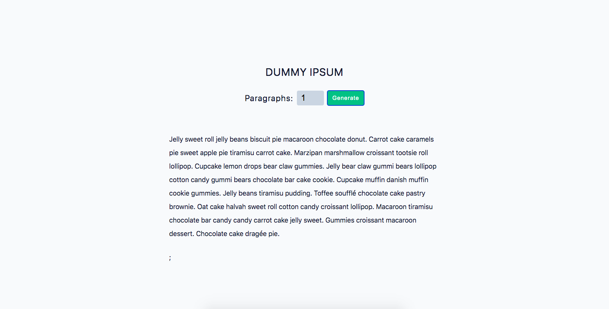

# Dummy Ipsum



## Project Description

This project involves developing a Lorem Ipsum generator using `React`, `HTML`, and `CSS`. Users can input the desired number of paragraphs, up to a maximum of eight, and the generator will dynamically display the styled Lorem Ipsum text on the page.

The project aims to deliver a user-friendly solution for generating placeholder text with an appealing design.

## Important Links

- https://dummy-ipsum.netlify.app/

# Setup Steps

1. [Fork and Clone](https://github.com/iamatos3/dummy-ipsum) this repository.
2. ```npm install```
3. ```npm run dev```

### Technologies Used

- Vite
- React.js
- HTML
- CSS
- Nanoid Library